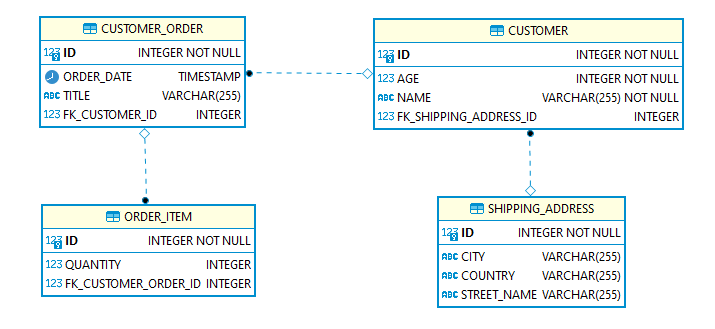
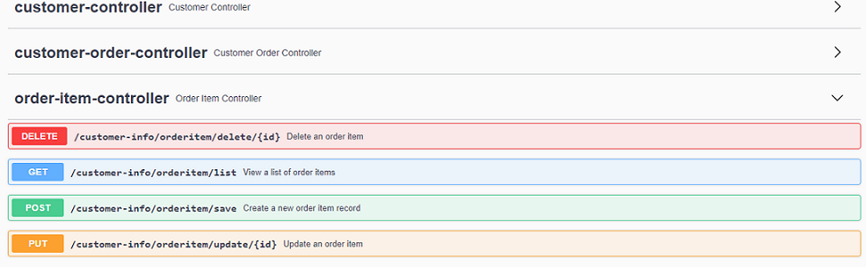

## spring-boot-hibernate-unidirectional-one-to-many-relationship-mapping

1- Implement hibernate unidirectional one-to-many relational mapping  
2- ER diagram :   
NOT : One CustomerOrder is related to Many OrderItem entities  

  

3- Start Spring Boot application with a specific profile such as "-Dspring.profiles.active=dev" .  
4- swagger-ui can be accessed from URL : http://localhost:8080/customer-info/swagger-ui/   

  
 

### Tech Stack
Java 11  
H2 Database Engine  
spring boot  
spring data jpa  
spring web  
hibernate  
logback  
maven  
junit  
springfox-swagger-ui  
datasource-proxy  
 

## API OPERATIONS
### Save customer sucessfully to database

Method : HTTP.POST  
URL : localhost:8080/customer-info/customer/save  

Request : 
<pre>
curl --location --request POST 'localhost:8080/customer-info/customer/save' \
--header 'Content-Type: application/json' \
--data-raw '{
    "name": "name1",
    "age": 1,
    "shippingAddress": {
        "streetName": "software",
        "city": "ankara",
        "country": "TR"
    }
}'
</pre> 

Response : 

HTTP response code 200  
<pre>
{
    "id": 1,
    "name": "name1",
    "age": 1,
    "shippingAddress": {
        "id": 1,
        "streetName": "software",
        "city": "ankara",
        "country": "TR"
    }
}
</pre>

### Create a new CustomerOrder with many OrderItems for Customer id = 1.

Method : HTTP.POST  
URL : localhost:8080/customer-info/customerorder/save  

Request : 
<pre>
curl --location --request POST 'localhost:8080/customer-info/customerorder/save' \
--header 'Content-Type: application/json' \
--data-raw '{
  "customer": {
    "age": 0,
    "id": 1,
    "name": "string",
    "shippingAddress": {
      "city": "string",
      "country": "string",
      "id": 1,
      "streetName": "string"
    }
  },
  "orderDate": "2021-05-05T16:00:35.350Z",
  "orderItems": [
    {
      "quantity": 1
    },
    {
      "quantity": 2
    }
  ],
  "title": "string"
}'
</pre> 

Response : 

HTTP response code 200  
<pre>
{
    "id": 1,
    "orderDate": "2021-05-05T16:00:35.35",
    "customer": {
        "id": 1,
        "name": "string",
        "age": 0,
        "shippingAddress": {
            "id": 1,
            "streetName": "string",
            "city": "string",
            "country": "string"
        }
    },
    "title": "string",
    "orderItems": [
        {
            "id": 1,
            "quantity": 1
        },
        {
            "id": 2,
            "quantity": 2
        }
    ]
}
</pre> 

### List OrderItems saved to database

Method : HTTP.GET  
URL : localhost:8080/customer-info/orderitem/list  

Request : 
<pre>
curl --location --request GET 'localhost:8080/customer-info/orderitem/list'
</pre> 

Response : 

HTTP response code 200  
<pre>
[
    {
        "id": 1,
        "quantity": 1
    },
    {
        "id": 2,
        "quantity": 2
    }
]
</pre> 
